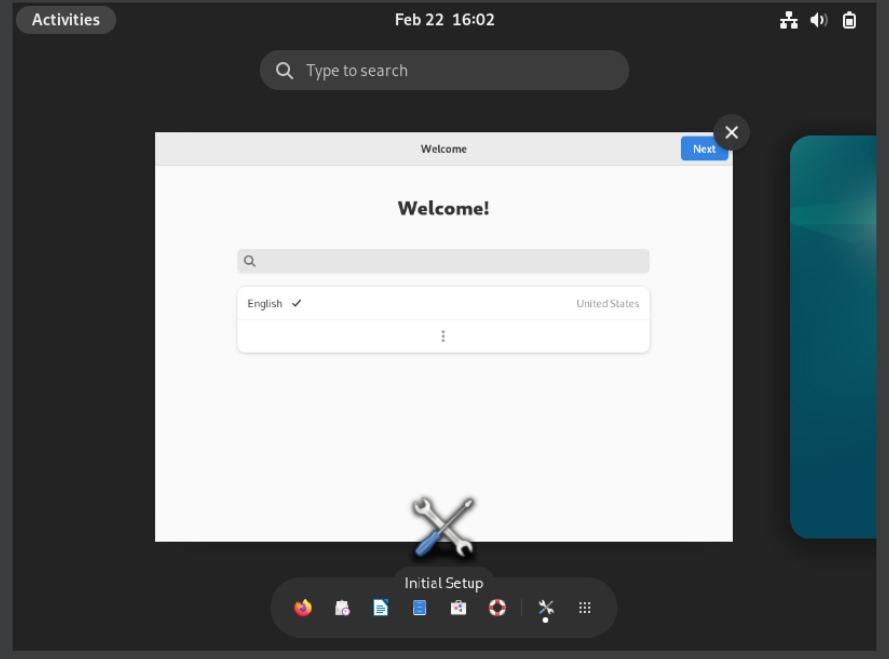

  <h1 style="text-align: center;font-weight: bold">Praktikum 1 Sistem Operasi</h1>
  <h4 style="text-align: center;">Dosen Pengampu : Dr. Ferry Astika Saputra, S.T., M.Sc.</h4>

 

  
  <h3 style="text-align: center;">Disusun Oleh : </h3>
  

    <strong>Fauzan Abderrasheed (3123500020) </strong> 
    <strong>Muhammad Rafi Dhiyaulhaq (3123500004) </strong> 
    <strong>Arva Zaki Fanadzan (3123500014)</strong>
  

<h3 style="text-align: center;line-height: 1.5">Politeknik Elektronika Negeri Surabaya Departemen Teknik Informatika Dan Komputer Program Studi Teknik Informatika 2023/2024</h3>
  

## Daftar Isi
1. [Pendahuluan](#apa-itu-sistem-operasi)
2. [Soal](#soal)

## apa itu Sistem Operasi?
<strong>Sistem Operasi</strong> adalah perangkat lunak pada lapisan pertama yang ditempatkan pada memori komputer pada saat komputer dinyalakan booting. Sedangkan software-software lainnya dijalankan setelah sistem operasi berjalan, dan sistem operasi akan melakukan layanan inti untuk software-software itu.

## Soal
#### Sebutkan dan jelaskan proses booting !
1 . <strong>Power ON</strong>
Saat tombol power atau tombol reset dihidupkan, sumber daya listrik akan mengalir ke komputer.
Kemudian, perangkat keras akan menerima daya untuk dinyalakan.

2 . <strong>POST (Power On Selft Test)</strong>
Setelah dinyalakan, komputer akan melakukan Power-On Self-Test atau POST, yang merupakan serangkaian tes perangkat keras untuk memastikan bahwa semuanya berfungsi dengan baik. 
POST akan memeriksa RAM, prosesor, kartu grafis, dan perangkat keras lainnya. 

3 . <strong>Inisialisasi perangkat keras</strong>
Setelah POST selesai, komputer akan menginisialisasi perangkat keras seperti hard drive, keyboard, mouse, dan perangkat lainnya. 
Proses ini melibatkan tahap mengenali perangkat keras, memuat driver yang diperlukan, dan menyiapkan perangkat untuk digunakan.

4 . <strong>Membaca sektor boot</strong>
Selanjutnya, komputer akan mencari sektor boot di hard drive atau perangkat penyimpanan lainnya. 
Sektor boot adalah area khusus yang berisi instruksi awal untuk memuat sistem operasi.

5 . <strong>Memuat Sistem Operasi</strong>
Setelah sektor boot ditemukan, komputer akan memuat sistem operasi ke dalam memori utama (RAM). 
Kemudian, sistem operasi akan mengambil alih kendali dan mulai menjalankan program-program yang diperlukan untuk mengoperasikan komputer.

#### Bagaimana cara install Linux Debian di Virtual box ?

## Installation
1. Masuk ke link downloaad virtualbox, pilih sesuai sistem operasi masing-masing dan download akan dimulai

2. Masuk ke link downloaad file iso linux debian,lalu klik link untuk download

3. Masuk ke dalam aplikasi virtual box dan klik tombol <strong>New</strong>

4. Setelah klik tombol new akan ada tampilan seperti ini,masukkan name untuk virtual machine,dan tentukan folder penyimpanan untuk virtual machine ini,serta masukkan file iso linux debian yang telah di download ,dan klik <strong>Next</strong>

5. Tentukan RAM dan jumlah CPU yang diinginkan disini input RAM 4096MB atau 4GB dan jumlah CPU 2,jika sudah klik <strong>Next</strong>

6. Tentukan Disk Size,jika sudah klik <strong>Next</strong>

7. Setelah mengisi beberapa inputan tadi akan muncul tampilan yang menjelaskan apa saja yang telah di inputkan tadi,jika merasa sudah benar silahkan klik <strong>Finish</strong>

8. klik <strong>Start</strong> pada virtual machine yang telah dibuat

9. Pilih <strong>Graphical Install</strong>

10. Pilih bahasa yang ingin digunakan, jika sudah klik <strong>Continue</strong>

11. Pilih lokasi yang ingin digunakan, jika sudah klik <strong>Continue</strong>

12. Pilih kongfigurasi keyboard, jika sudah klik <strong>Continue</strong>

13. Tunggu hingga proses loading selesai

14. Masukkan hostname, jika sudah klik <strong>Continue</strong>

15. Masukkan domain jika ada jika tidak ada bisa dikosongkan, jika sudah klik <strong>Continue</strong>

16. Masukkan password untuk root user, jika sudah klik <strong>Continue</strong>

17. Masukkan nama , jika sudah klik <strong>Continue</strong>

18. Pilih waktu sesuai lokasi yang telah dipilih tadi , jika sudah klik <strong>Continue</strong>

19. terdapat beberapa opsi untuk mempartisi disk jika ingin mengisi manual pilih opsi manual , jika sudah klik <strong>Continue</strong>

20. Klik pada VBOX HARDISK dan klik <strong>Continue</strong>

21. klik <strong>Yes dan Continue</strong>

22. klik <strong>Create a new partision dan Continue</strong>

23. Masukkan size untuk /, jika sudah klik <strong>Continue</strong>

24. klik <strong>Beginning dan Continue</strong>

25. Buat partisi baru dan isikan untuk /storage, jika sudah klik <strong>Continue</strong>

26. pada mount point pilih <strong>Enter manually dan Continue</strong>

27. isikan /storage dan klik <strong>Continue</strong>

28. buat partisi baru dan isikan size untuk swap dan klik <strong>Continue</strong>

29. pilih opsi swap area dan klik <strong>Done setting up the partision</strong>

30. jika sudah membuat partisi akan ada list partisi yang sudah diisikan,dan jika sudah sesuai klik <strong>Finish partitioning and write changes to disk dan Continue</strong>

31.  <strong>Pilih No dan Continue</strong>

32. Pilih lokasi untuk konfigurasi package ,pilih indonesia dan klik <strong>Continue</strong>

33. Pilih kebo.pens.ac.id dan klik <strong>Continue</strong>

34. kosongkan http proxy dan klik <strong>Continue</strong>

35. klik <strong>Continue</strong>

36. pilih /dev/sda dan klik <strong>Continue</strong>

37. ini menandakan debian siap digunakan,klik <strong>Continue</strong>

37. Linux debian telah siap digunakan...

