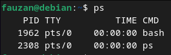
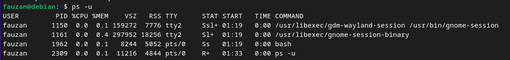
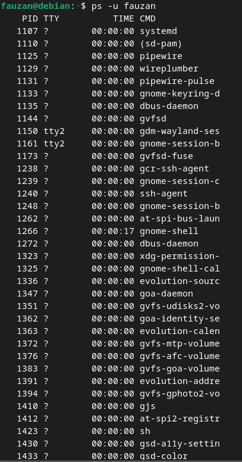
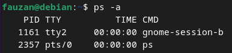
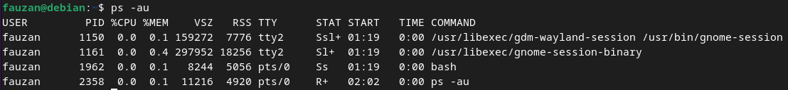

  <h1 style="text-align: center;font-weight: bold">Praktikum 4A Sistem Operasi</h1>
  <h4 style="text-align: center;">Dosen Pengampu : Dr. Ferry Astika Saputra, S.T., M.Sc.</h4>

 

  
  <h3 style="text-align: center;">Disusun Oleh : </h3>
  

    <strong>Fauzan Abderrasheed (3123500020) </strong> 
    <strong>Muhammad Rafi Dhiyaulhaq (3123500004) </strong> 
    <strong>Arva Zaki Fanadzan (3123500014)</strong>
  

<h3 style="text-align: center;line-height: 1.5">Politeknik Elektronika Negeri Surabaya Departemen Teknik Informatika Dan Komputer Program Studi Teknik Informatika 2023/2024</h3>
  

<h1 style="text-align: center;font-weight: bold">Proses dan Manajemen Proses</h1>

## Daftar isi
1. [Jawaban Tugas Pendahuluan](#tugas-pendahuluan)
2. [Laporan Hasil Percobaan](#percobaan)

## Tugas Pendahuluan
Jawablah pertanyaan-pertanyaan di bawah ini :
1. Apa yang dimaksud dengan proses ?
2. Apa yang dimaksud perintah untuk menampilkan status proses :
    `ps`, `pstree`.
3. Sebutkan opsi yang dapat diberikan pada perintah ps
4. Apa yang dimaksud dengan sinyal ? Apa perintah untuk mengirim sinyal ?
5. Apa yang dimaksud dengan proses foreground dan background pada job control ?
6. Apa yang dimaksud perintah-perintah penjadwalan prioritas :
    `top`, `nice`, `renice`

## Percobaan
1. Login sebagai user.
2. Download program C++ untuk menampilkan bilangan prima yang bernama
primes.
3. Lakukan percobaan-percobaan di bawah ini kemudian analisa hasil percobaan.
4. Selesaikan soal-soal latihan.

### Percobaan 1 : Status Proses

1. Pindah ke command line terminal (tty2) dengan menekan Ctrl+Alt+F2 
dan login ke terminal sebagai user

2. Instruksi `ps`

    

    Analisa : 
    Instruksi `ps` digunakan untuk melihat kondisi proses yang ada 

3. Instruksi `ps -u`

    

    Analisa : 
    Instruksi `ps -u` (user), digunakan untuk melihat elemen/faktor lain dari kondisi proses yang ada serta menampilkan nama user

4. Instruksi `ps -u <user>`

    

    Analisa :
    Mencari proses yang spesifik pemakai. Proses diatas hanya terbatas pada proses milik pemakai. Perintah tersebut digunakan untuk menampilkan proses pada user yang kita inginkan.

5. Instruksi `ps -a`

    

    Analisa :
    Perintah tersebut digunakan untuk menampilkan daftar dari semua proses yang sedang berjalan

6. Instruksi `ps -au`

    

    Analisa :
    Perintah ps -au digunakan untuk menampilkan informasi yang lebih rinci tentang semua proses yang sedang berjalan, termasuk proses yang dimiliki oleh pengguna (termasuk proses terminal yang sedang dijalankan) dan proses sistem.

