

  <h1 style="text-align: center;font-weight: bold">Praktikum 4A Sistem Operasi</h1>
  <h4 style="text-align: center;">Dosen Pengampu : Dr. Ferry Astika Saputra, S.T., M.Sc.</h4>

 

  
  <h3 style="text-align: center;">Disusun Oleh : </h3>
  

    <strong>Fauzan Abderrasheed (3123500020) </strong> 
    <strong>Muhammad Rafi Dhiyaulhaq (3123500004) </strong> 
    <strong>Arva Zaki Fanadzan (3123500014)</strong>
  

<h3 style="text-align: center;line-height: 1.5">Politeknik Elektronika Negeri Surabaya Departemen Teknik Informatika Dan Komputer Program Studi Teknik Informatika 2023/2024</h3>
  

<h1 style="text-align: center;font-weight: bold">Proses dan Manajemen Proses</h1>

## Daftar isi
1. [Jawaban Tugas Pendahuluan](#tugas-pendahuluan)
2. [Laporan Hasil Percobaan](#percobaan)

## Tugas Pendahuluan
Jawablah pertanyaan-pertanyaan di bawah ini :
1. Apa yang dimaksud dengan proses ?
2. Apa yang dimaksud perintah untuk menampilkan status proses :
    `ps`, `pstree`.
3. Sebutkan opsi yang dapat diberikan pada perintah ps
4. Apa yang dimaksud dengan sinyal ? Apa perintah untuk mengirim sinyal ?
5. Apa yang dimaksud dengan proses foreground dan background pada job control ?
6. Apa yang dimaksud perintah-perintah penjadwalan prioritas :
    `top`, `nice`, `renice`

## Percobaan
1. Login sebagai user.
2. Download program C++ untuk menampilkan bilangan prima yang bernama
primes.
3. Lakukan percobaan-percobaan di bawah ini kemudian analisa hasil percobaan.
4. Selesaikan soal-soal latihan.

### Percobaan 1 : Status Proses

1. Pindah ke command line terminal (tty2) dengan menekan Ctrl+Alt+F2 
dan login ke terminal sebagai user

2. Instruksi `ps`

    

    Analisa : 
    Instruksi `ps` digunakan untuk melihat kondisi proses yang ada 

3. Instruksi `ps -u`

    

    Analisa : 
    Instruksi `ps -u` (user), digunakan untuk melihat elemen/faktor lain dari kondisi proses yang ada serta menampilkan nama user

4. Instruksi `ps -u <user>`

    

    Analisa :
    Mencari proses yang spesifik pemakai. Proses diatas hanya terbatas pada proses milik pemakai. Perintah tersebut digunakan untuk menampilkan proses pada user yang kita inginkan.

5. Instruksi `ps -a`

    

    Analisa :
    Perintah tersebut digunakan untuk menampilkan daftar dari semua proses yang sedang berjalan

6. Instruksi `ps -au`

    

    Analisa :
    Perintah ps -au digunakan untuk menampilkan informasi yang lebih rinci tentang semua proses yang sedang berjalan, termasuk proses yang dimiliki oleh pengguna (termasuk proses terminal yang sedang dijalankan) dan proses sistem.

7. Logout dan tekan Alt+F7 untuk kembali ke mode grafis

### Percobaan 2 : Menampilkan Hubungan Proses Parent and Child

1. Pindah ke command line terminal (tty2) dengan menekan Ctrl+Alt+F2 
dan login ke terminal sebagai user

2. Instruksi `ps -eH`

    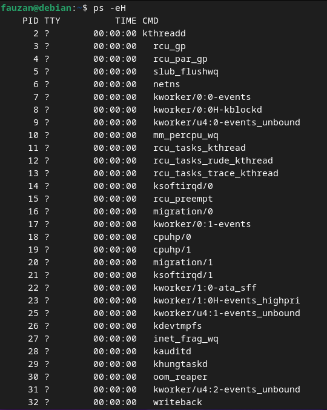

    Analisa : 
    Perintah tersebut digunakan untuk menampilkan seluruh proses secara hierarki. Dimana opsi *e* digunakan untuk memilih semua proses dan opsi *H* untuk menghasilkan tampilan proses secara hierarki. 

3. Instruksi `ps -e f`

    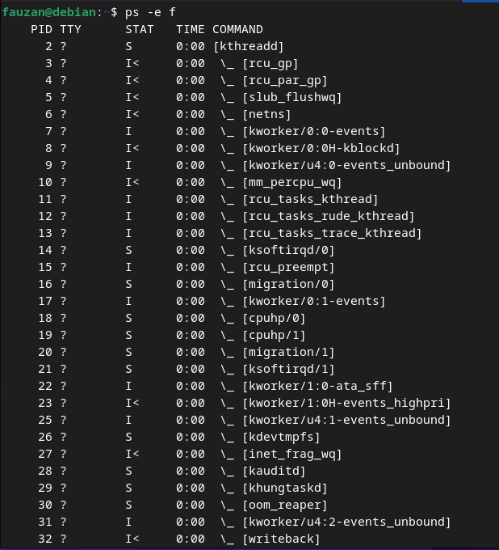

    Analisa : 
    Menghasilkan tampilan serupa dengan langkah 2. Opsi *f* disini berfungsi untuk menampilkan STAT dari sebuah proses dan menampilkan status proses dengan karakter grafis ( \ dan _ ) 

4. Instruksi `pstree`

    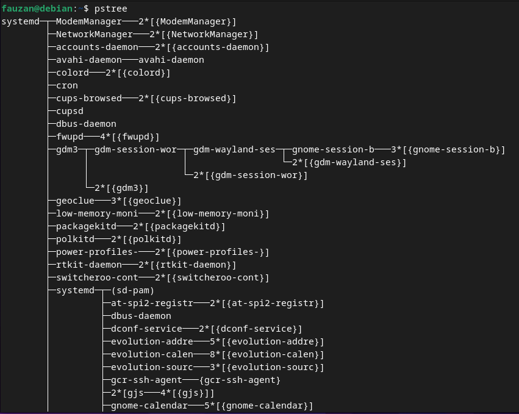

    Analisa : 
    Gambar diatas tampak seperti pohon atau diagram. Perintah tersebut berfungsi untuk menampilkan struktur proses yang berjalan di sistem secara hirarkis parent/child.

5. Instruksi `pstree | grep mingetty`

    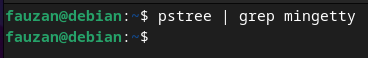

    Analisa : 
    Perintah ini berfungsi untuk menampilkan semua proses mingetty yang berjalan pada sistem yang berupa console virtual. Pada gambar diatas tidak ada output yang keluar dikarenakan tidak ada proses mingetty yang sedang berjalan

6. Instruksi `pstree -p`

    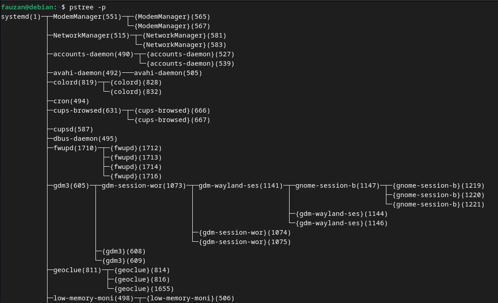

    Analisa : 
    Perintah `pstree` -p dalam sistem operasi Linux adalah varian dari perintah pstree yang menampilkan struktur proses dalam bentuk pohon, namun dengan tambahan informasi tentang ID proses (PID) untuk setiap proses yang ditampilkan.

7. Instruksi `pstree -h`

    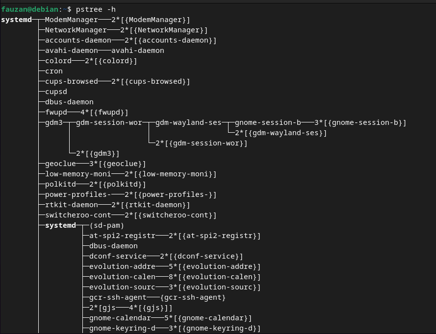

    Analisa : 
    Dalam sistem Linux, perintah `pstree -h` digunakan untuk menampilkan struktur proses dalam bentuk pohon dengan opsi "human-readable" yang menyederhanakan ukuran angka yang besar ke format yang lebih mudah dipahami manusia.

### Percobaan 3 : Menampilkan Status Proses dengan Berbagai Format

1. Pindah ke command line terminal (tty2) dengan menekan Ctrl+Alt+F2 
dan login ke terminal sebagai user

2. Instruksi `ps -e | more`

    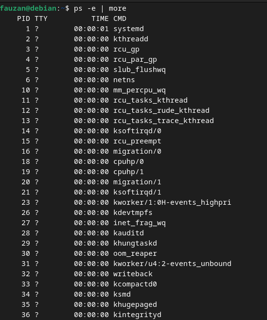

    Analisa : 
    Perintah `ps -e | more` berfungsi untuk menampilkan daftar semua proses yang sedang berjalan di sistem secara berurutan, dan outputnya akan ditampilkan secara bertahap menggunakan perintah `more`

3. Instruksi `ps ax | more`

    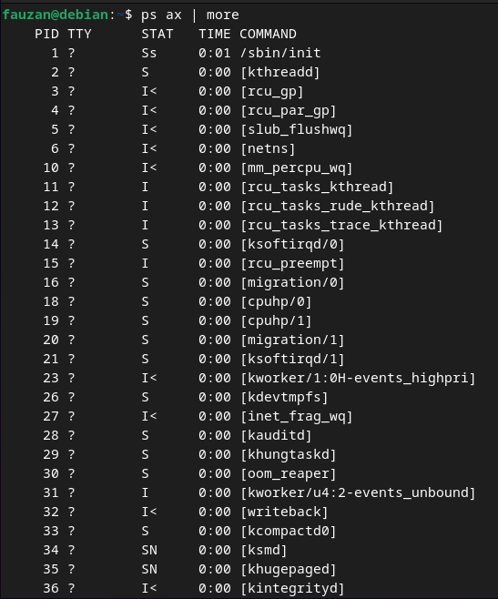

    Analisa : 
    Opsi a akan menampilkan semua proses yang dihasilkan terminal (TTY). Opsi x menampilkan semua proses yang tidak dihasilkan terminal. Yang kemudian outputnya ditampilkan secara bertahap menggunakan perintah `more`

4. Instruksi `ps ef | more`

    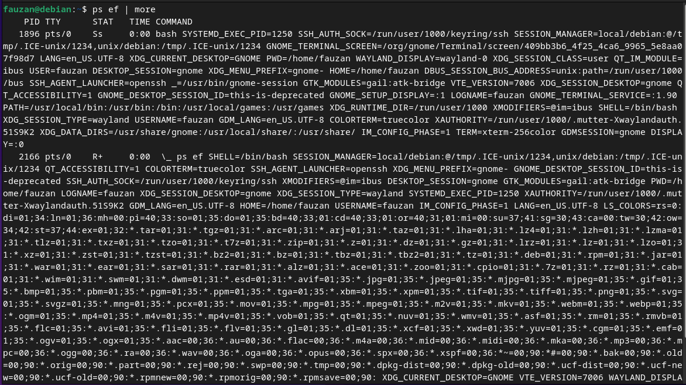

    Analisa : 
    Ketika perintah `ps – ef | more` dieksekusi maka opsi *-ef* akan menampilkan semua proses dalam format daftar penuh. Yang kemudian outputnya ditampilkan secara bertahap menggunakan perintah `more`

5. Instruksi `ps -eo pid,cmd | more`

    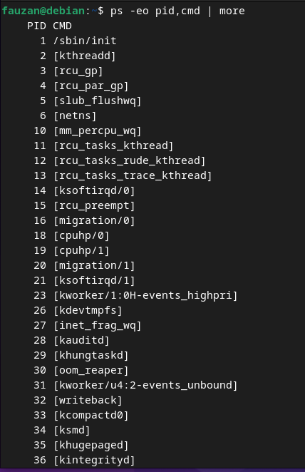

    Analisa : 
    Opsi `–eo` akan menampilkan semua proses dalam format sesuai definisi user yaitu terdiri dari kolom PID dan CMD. Yang kemudian outputnya akan ditampilkan secara bertahap menggunakan perintah `more`

6. Instruksi `ps -eo pid,ppid,%mem,cmd | more`

    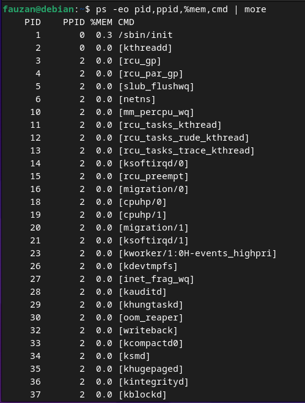

    Analisa : 
    Perintah `ps -eo pid,ppid,%mem,cmd | more` akan menampilkan kolom PID, PPID dan %MEM. Dimana PPID adalah proses ID dari proses parent. %MEM menampilkan persentasi memory system yang digunakan proses. Jika proses hanya menggunakan sedikit memory system akan ditampilkan 0.

7. Logout dan tekan Alt+F7 untuk kembali ke mode grafis
    
### Percobaan 4 : Mengontrol Proses pada Shell

1. Pindah ke command line terminal (tty2) dengan menekan Ctrl+Alt+F2 dan login ke terminal sebagai user.

2. Instruksi `yes`

    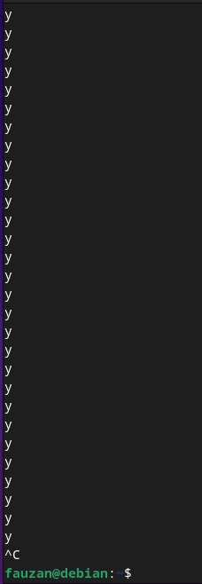

    Analisa : 
    Perintah `yes` akan memberikan output huruf y yang tidak pernah berhenti. Untuk menghentikannya harus menggunakan *Ctrl + C*

3. Instruksi `yes > /dev/null`

    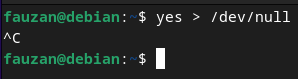

    Analisa : 
    Membelokkan standard output dari perintah `yes` ke `/dev/null`. Untuk menghentikannya harus menggunakan *Ctrl + C*.

4. Instruksi `yes > /dev/null &`

    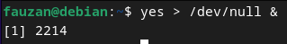

    Analisa : 
    Salah satu cara agar perintah `yes` tetap dijalankan tetapi shell tetap digunakan untuk hal yang lain dengan meletakkan proses pada background dengan menambahkan karakter `&` pada akhir perintah. `[1]` merupakan job number PID.

5. Instruksi `jobs`

    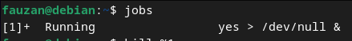

    Analisa : 
    Perintah di atas digunakan untuk melihat status proses yang telah digunakan.

6. Instruksi `kill %<nomor jobs>`

    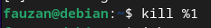

    Analisa : 
    Perintah `kill` digunakan untuk menghentikan job diikuti oleh *job number* atau PID Proses. Untuk identifikasi job number, penulisan perintah diikuti prefix dengan karakter `%`.

7. Instruksi `jobs`

    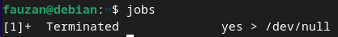

    Analisa : 
    Ini adalah tahap terakhir, yaitu menggunakan perintah `jobs` untuk melihat status job setelah diterminasi.