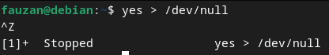
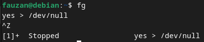
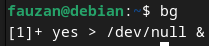
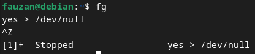
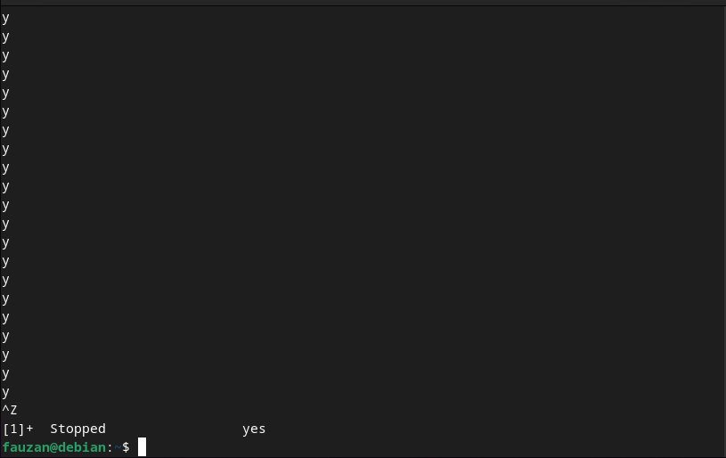
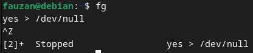
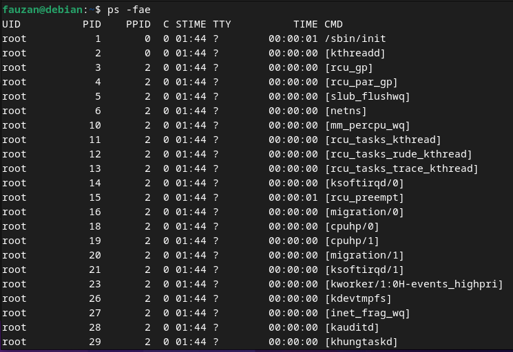

  <h1 style="text-align: center;font-weight: bold">Praktikum 4B Sistem Operasi</h1>
  <h4 style="text-align: center;">Dosen Pengampu : Dr. Ferry Astika Saputra, S.T., M.Sc.</h4>

 

  
  <h3 style="text-align: center;">Disusun Oleh : </h3>
  

    <strong>Fauzan Abderrasheed (3123500020) </strong> 
    <strong>Muhammad Rafi Dhiyaulhaq (3123500004) </strong> 
    <strong>Arva Zaki Fanadzan (3123500014)</strong>
  

<h3 style="text-align: center;line-height: 1.5">Politeknik Elektronika Negeri Surabaya Departemen Teknik Informatika Dan Komputer Program Studi Teknik Informatika 2023/2024</h3>
  

<h1 style="text-align: center;font-weight: bold">Proses dan Manajemen Proses</h1>

## Daftar isi
1. [Jawaban Tugas Pendahuluan](#tugas-pendahuluan)
2. [Laporan Hasil Percobaan](#percobaan)

### Percobaan 5 : Menghentikan dan Memulai Kembali Job

1. Instruksi `yes > /dev/null`

    

    Analisa : 
    Cara lain meletakkan job pada background dengan memulai job secara normal (pada foreground), stop job dan memulai lagi pada background. Gunakan perintah `yes > /dev/null` untuk memulai job baru. Hentikan sementara job (suspend), bukan menghentikannya (terminate), tetapi menghentikan sementara job sampai di restart. Untuk menghentikan sementara job gunakan *Ctrl + Z*

2. Instruksi `fg`

    

    Analisa : 
    Perintah `fg` disini digunakan untuk me-restart job pada *foreground*.

3. Instruksi `bg`

    

    Analisa : 
    Setelah instruksi `fg`, Shell akan menampilkan nama perintah yang diletakkan di *foreground*. Stop job lagi dengan *Ctrl + Z*. Kemudian gunakan perintah `bg` untuk meletakkan job pada *background*. 
     
    Instruksi `fg`

    

    Analisa : 
    Job tidak bisa dihentikan dengan *Ctrl + Z* karena job berada pada *background*. Untuk menghentikannya, letakkan job pada *foreground* dengan `fg` dan kemudian hentikan sementara dengan *Ctrl + Z*.

4. Instruksi `yes &`

    

    Analisa : 
    Job pada *background* dapat digunakan untuk menampilkan teks pada terminal, dimana dapat diabaikan jika mencoba mengerjakan job lain seperti perintah di atas. Untuk menghentikannya tidak dapat menggunakan *Ctrl + C*. Job harus dipindah ke *foreground* baru diberhentikan dengan cara tekan `fg` dan tekan enter, Kemudian lanjutkan dengan *Ctrl + Z* untuk menghentikan sementara

5. Instruksi `fg %2`, `bg %2` atau `%2`

    

    Analisa : 
    Perintah di atas digumakan apabila ingin menjalankan banyak job dalam satu waktu, letakkan job pada *foreground* atau *background* dengan memberikan job ID. 

6. Instruksi `fg`

    

    Analisa : 
    tekan `fg` dan tekan *Enter*, kemudian dilanjutkan dengan *Ctrl-Z* untuk menghentikan sementara

7. Instruksi `ps -fae`

    

    

    

    Analisa : 
    Lihat job dengan perintah `ps -fae` dan tekan Enter. Kemudian hentikan proses dengan perintah kill. Pada proses di atas proses yang dihentikan adalah proses dengan PID 6142, yaitu proses `yes > /dev/null`

8. Logout dan tekan Alt+F7 untuk kembali ke mode grafis

     